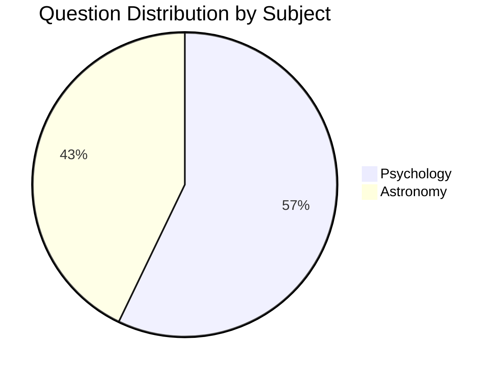

<!-- markdownlint-disable MD033 -->

# �� Questions Database Documentation

[](CHANGELOG.md) [](https://github.com/Exios66/truth-deception-architecture/releases) [](https://github.com/Exios66/truth-deception-architecture/tree/main/Questions_DB)

## 📑 Contents

* [Overview](./#-overview)
* [Database Structure](./#-database-structure)
* [Subject Databases](./#-subject-databases)
* [Usage Guidelines](./#-usage-guidelines)
* [Contribution Guidelines](./#-contribution-guidelines)

### 🔍 Overview

A comprehensive collection of structured question databases spanning multiple academic disciplines. Each database follows strict formatting guidelines and includes detailed metadata for effective categorization and usage tracking.

### 📊 Database Structure

#### Schema

| Field            | Type      | Description         | Example                                              |
| ---------------- | --------- | ------------------- | ---------------------------------------------------- |
| `id`             | Integer   | Unique identifier   | `PSY001`                                             |
| `question`       | String    | Question text       | "What is cognitive dissonance?"                      |
| `correct_answer` | String    | Correct response    | "Mental conflict from inconsistent beliefs"          |
| `choices`        | Array\[3] | Alternative answers | \["Memory loss", "Learning style", "Social anxiety"] |
| `difficulty`     | Integer   | Level (0-2)         | 1 (Medium)                                           |
| `category`       | String    | Main subject        | "Psychology"                                         |
| `subcategory`    | String    | Specific topic      | "Cognitive Psychology"                               |
| `tags`           | Array     | Related concepts    | \["cognition", "behavior", "mental processes"]       |
| `version`        | String    | Database version    | "v1.2"                                               |

#### Directory Structure

```bash
Questions_DB/
├── Psychology/
│   ├── PSYC-v1.md            # Psychology questions database
│   └── metadata.json         # Database metadata
├── Astronomy/
│   ├── ASTRN-v1.md          # Astronomy questions database
│   └── metadata.json         # Database metadata
├── templates/
│   └── question_template.md  # Standard question format
└── README.md                 # This documentation
```

### 📚 Subject Databases

#### 🧠 Psychology (PSYC-v1)

  

**Topic Coverage**

* 🔬 Neuroscience (8 questions)
* 📖 Psychological Theories (8 questions)
* 🏥 Mental Health (6 questions)
* 📊 Research Methods (6 questions)
* 🧩 Cognitive Processes (6 questions)
* 📝 Learning and Memory (6 questions)

#### 🌌 Astronomy (ASTRN-v1)   

**Astronomy Topics**

* 🌍 Planets and Solar System (6 questions)
* ⚡ Physics (6 questions)
* 🌟 Stars and Galaxies (6 questions)
* 🔄 Celestial Mechanics (4 questions)
* 📚 Historical Models (4 questions)
* 📏 Measurements (4 questions)

### 📋 Usage Guidelines

#### Question Selection

* Filter by difficulty level (0=Easy, 1=Medium, 2=Hard)
* Group by knowledge category or topic focus
* Use version tracking for content updates

#### Implementation

```python
from question_db import QuestionDatabase

# Initialize Database
db = QuestionDatabase('Psychology/PSYC-v1.md')

# Get questions by criteria
questions = db.get_questions(
    difficulty=1,
    category='Neuroscience',
    count=5,
    randomize=True
)
```

### Format Standards

* Use markdown tables for consistency
* Include all required fields
* Follow naming conventions:
  * `SUBJ-vX.md` (e.g., `PSYC-v1.md`)
  * Use subject codes from approved list

### 🤝 Contribution Guidelines

#### Adding Questions

1. Use the template from `templates/question_template.md`
2. Follow the schema requirements
3. Include comprehensive metadata
4. Submit via pull request

#### Quality Standards

* Clear, unambiguous question text
* One definitively correct answer
* Plausible distractor choices
* Appropriate difficulty rating
* Accurate categorization
* Peer review required

#### Version Control

* Major updates increment version number
* Document changes in changelog
* Maintain backward compatibility
* Include migration guides

### 📊 Statistics



### 📄 License

This database is licensed under the MIT License - see the [LICENSE](../LICENSE/) file for details.

### 📞 Contact

* **Maintainer**: Jack J Burleson
* **GitHub**: [@Exios66](https://github.com/Exios66)
* **Project Link**: [truth-deception-architecture](https://github.com/Exios66/truth-deception-architecture)

***

**Part of the** [**Neural Architecture of Truth & Deception Project**](https://github.com/Exios66/truth-deception-architecture)
